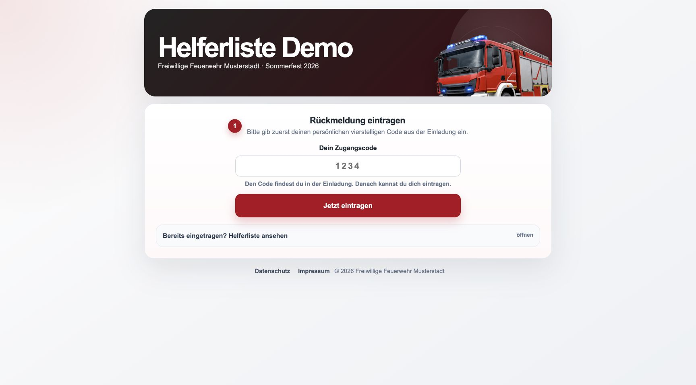
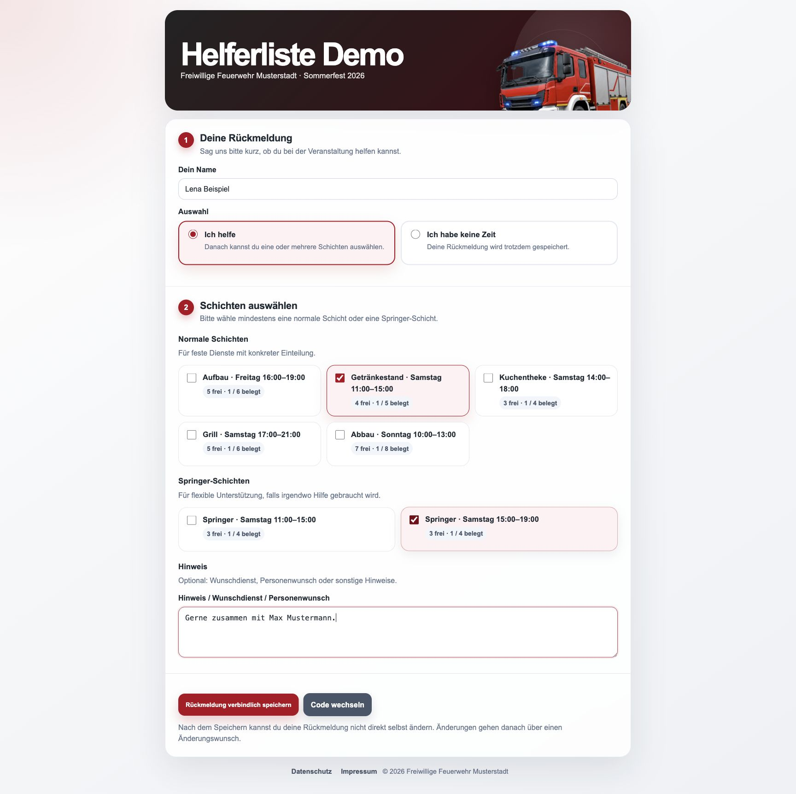
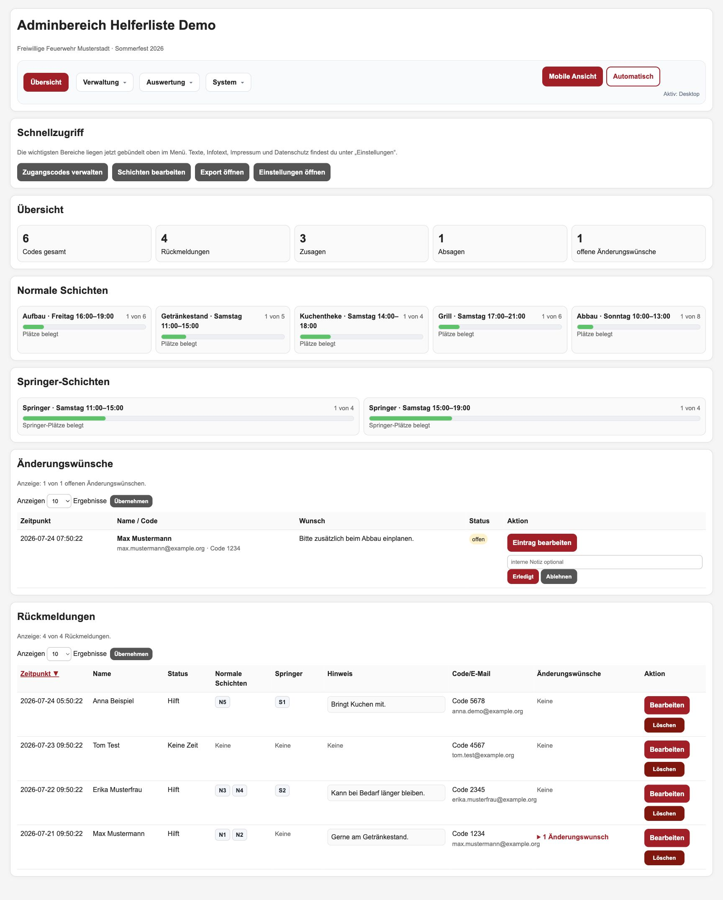
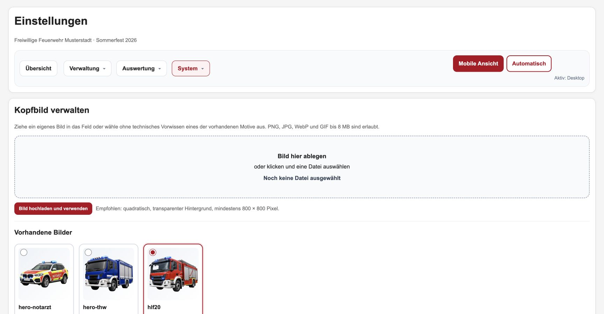

# Helferliste by MOWST

[](https://mowst.de)

Eine schlanke, selbst gehostete Web-Anwendung zur Organisation von Helferinnen und Helfern bei Veranstaltungen. Sie eignet sich für Vereine, Feuerwehren, Hilfsorganisationen, Ortsverbände und andere Gruppen.

Entwickelt und gepflegt von **[MOWST — Digitale Werkstatt](https://mowst.de)**. MOWST baut klare Websites und praktische digitale Werkzeuge für kleine Betriebe, Vereine und gute Ideen.

Helfer benötigen kein Benutzerkonto und keine App. Ein persönlicher vierstelliger Code oder Direktlink genügt. Die Anwendung benötigt weder Framework noch Composer oder Node.js: PHP 8.x und SQLite reichen aus.

## Woran ich gerade arbeite

Die Helferliste ist kein abgeschlossenes Archivprojekt. Ich entwickle sie Schritt für Schritt zu einem Werkzeug weiter, das sich auch außerhalb der Feuerwehr einfach einsetzen lässt.

Im aktuellen Produktstand sind bereits eine geführte Ersteinrichtung, sichere Datenbankaktualisierungen, Veranstaltungsarchive, deutlich flexiblere Schichten und ein geprüfter CSV-Kontaktimport hinzugekommen. Neue Funktionen werden zuerst im Entwicklungszweig praktisch getestet und laufen automatisch unter PHP 8.3, 8.4 und 8.5 durch. Fertige Arbeitspakete werden anschließend über einen Pull Request in den geschützten Hauptzweig übernommen.

## Einblicke

Alle abgebildeten Namen, E-Mail-Adressen, Codes und Veranstaltungsangaben sind frei erfundene Testdaten.

### Öffentliche Startseite



### Rückmeldung und Schichtauswahl



### Adminübersicht



### Einstellungen und Bildverwaltung



## Funktionen

### Öffentliche Helferseite

- Zugang per persönlichem Code oder Direktlink
- Zu- oder Absage mit Name
- Auswahl normaler Schichten und flexibler Springer-Schichten
- automatische Anzeige freier und belegter Plätze
- Schutz vor Überbuchung voller Schichten
- freiwilliges Hinweisfeld für Wünsche und Rückfragen
- einmalige verbindliche Rückmeldung pro Code
- nachträgliche Änderungswünsche ohne unbemerkte Datenänderung
- anonyme Belegungsübersicht nach eigener Rückmeldung
- mobiloptimierte Bedienung

### Administration

- Übersicht über Zusagen, Absagen und offene Rückmeldungen
- Rückmeldungen bearbeiten und löschen
- Änderungswünsche bearbeiten, ablehnen und dokumentieren
- normale und flexible Schichten mit Kapazität und Reihenfolge verwalten
- Datum, Beginn, Ende, Ort und öffentlichen Hinweis je Schicht pflegen
- Schichten mit allen Angaben duplizieren
- Zugangscodes einzeln oder aus E-Mail-Listen erzeugen
- Kontakte aus CSV-Dateien mit Vorschau und Dublettenprüfung importieren
- persönliche Einladungslinks kopieren
- ungenutzte Codes bereinigen
- Veranstaltung kontrolliert abschließen und aktive Daten zurücksetzen
- Admin-Passwort in der Oberfläche ändern
- automatische Sicherung beim Abschluss und Start der nächsten Veranstaltung aus einer Vorlage
- abgeschlossene Veranstaltungen mit anonymen Ergebnissen und Schichtauslastung archivieren
- personenbezogene Archivdaten optional exportieren und kontrolliert löschen
- Veranstaltung als Entwurf, veröffentlicht oder abgeschlossen verwalten
- Veröffentlichung erst nach verständlicher Prüfung der technischen Pflichtangaben
- umschaltbare Mobil- und Desktopansicht

### Anpassung ohne Programmierkenntnisse

Unter `System → Einstellungen` lassen sich unter anderem anpassen:

- Name der Anwendung, Organisation und Veranstaltung
- öffentliche Basis-URL
- sämtliche wichtigen Überschriften, Erklärungen, Beschriftungen und Schaltflächen
- Haupt-, Hintergrund-, Karten-, Text- und Auslastungsfarben
- Schriftart
- Impressum und Datenschutzkontakt
- Kopfbild aus der mitgelieferten Galerie
- eigenes Kopfbild per Dateiauswahl oder Drag-and-drop

Mitgeliefert werden neutrale Motive für Feuerwehr, THW und Notarzt. Eigene PNG-, JPG-, WebP- und GIF-Dateien bis 8 MB werden geprüft und sicher umbenannt.

### Export und Statistik

- kompletter TSV-Export für Excel
- gesonderter Export ausgefüllter Hinweise und Wünsche
- Änderungswunsch-Verlauf im Gesamtexport
- Rückmeldequote sowie Zu- und Absagen
- Auslastung der Schichten
- zusammengefasste Geräteklassen: Desktop, Mobilgerät, Tablet oder unbekannt
- keine E-Mail-Öffnungsanalyse und keine Speicherung vollständiger User-Agents bei neuen Installationen

## Voraussetzungen

- PHP 8.3 oder neuer; automatisch geprüft werden PHP 8.3, 8.4 und 8.5
- PHP-Erweiterungen `pdo_sqlite` und `fileinfo`
- SQLite 3
- Webserver mit PHP-Unterstützung, empfohlen: Nginx oder Apache; IIS ist ebenfalls möglich
- Schreibrechte des Webservers für `data/` und `www/assets/uploads/`
- HTTPS für einen öffentlichen Einsatz

## Installation

Die vollständigen Anleitungen für Ubuntu/Debian, manuelle Linux-Installationen, Windows/IIS und XAMPP stehen in [INSTALL.md](INSTALL.md).

Kurzfassung für einen frischen Ubuntu-/Debian-Server:

```bash
sudo bash Install/install_helferliste.sh
```

Anschließend `https://DEINE-DOMAIN/admin.php` öffnen, den einmaligen Einrichtungscode aus dem Installer eingeben und ein eigenes Admin-Passwort festlegen. Bei einer neuen Installation öffnet sich danach automatisch der vierstufige Einrichtungsassistent.

## Ersteinrichtung

Die Git-Version enthält bewusst keine persönlichen Daten. Der Einrichtungsassistent führt ohne technisches Vorwissen durch:

1. Organisation, Veranstaltung und Zeitraum.
2. öffentliche URL, Impressum und Datenschutzkontakt.
3. erste konkrete Schicht.
4. Abschluss als geschützter Entwurf oder direkte Veröffentlichung.

Mitgelieferte Schichten mit dem Präfix `Beispiel:` gelten nicht als veröffentlichungsfertig. Beim Anlegen der ersten echten Schicht deaktiviert der Assistent unbenutzte Beispiele. Kopfbild, Farben, Seitentexte und Zugangscodes werden anschließend in den normalen Verwaltungsbereichen gepflegt.

Eine genaue Checkliste steht in [CONFIGURATION.md](CONFIGURATION.md). Solange rechtliche Kontaktdaten fehlen, zeigen Impressum und Datenschutzerklärung einen sichtbaren Einrichtungs-Hinweis statt leerer Felder.

## Daten und Backups

Alle veränderlichen Daten liegen in:

- `data/helferliste.sqlite` – Rückmeldungen, Codes, Schichten und Einstellungen
- `www/assets/uploads/` – eigene Kopfbilder

Beide Orte gehören nicht in Git und werden durch `.gitignore` ausgeschlossen. Für ein vollständiges Backup müssen beide gesichert werden. Der Linux-Installer erhält vorhandene Bild-Uploads bei einer Aktualisierung.

Die Anwendung führt eine eigene Datenbank-Schema-Version. `Install/migrate.php` prüft Neuinstallationen und Aktualisierungen, erstellt vor notwendigen Migrationen eine konsistente SQLite-Sicherung und bricht bei Integritätsfehlern ab. `Install/restore.php` stellt eine Sicherung geprüft wieder her und sichert zuvor nochmals den aktuell aktiven Datenbankstand.

## Projektstruktur

```text
.
├── README.md
├── ROADMAP.md
├── tests/
│   ├── smoke.php
│   ├── migration.php
│   ├── restore.php
│   ├── event_lifecycle.php
│   ├── scheduling.php
│   ├── setup_wizard.php
│   ├── contact_import.php
│   └── http_admin_setup.sh
├── INSTALL.md
├── CONFIGURATION.md
├── SECURITY.md
├── CONTRIBUTING.md
├── CHANGELOG.md
├── LICENSE
├── Install/
│   ├── database_schema.sql
│   ├── migration_lib.php
│   ├── migrate.php
│   ├── restore.php
│   ├── reset_admin.php
│   ├── migrations/
│   │   ├── 001_baseline.sql
│   │   ├── 002_secure_admin_setup.sql
│   │   ├── 003_event_archives.sql
│   │   └── 004_event_schedule_and_shift_fields.sql
│   ├── install_helferliste.sh
│   └── install_helferliste_windows.bat
└── www/
    ├── version.php
    ├── index.php
    ├── admin.php
    ├── setup_wizard.php
    ├── setup_wizard_lib.php
    ├── contact_import_lib.php
    ├── event_archive.php
    ├── shift_helpers.php
    ├── settings.php
    ├── weitere PHP-Dateien
    └── assets/
        ├── hlf20.png
        ├── hero-thw.png
        ├── hero-notarzt.png
        └── uploads/
```

Auf einem empfohlenen Linux-Server wird `www/` nach `/var/www/helferliste/public/` kopiert. Die Datenbank liegt getrennt im nicht öffentlichen Ordner `/var/www/helferliste/data/`.

## Sicherheit und Datenschutz

Die Anwendung verarbeitet personenbezogene Daten. Der jeweilige Betreiber ist für Rechtsgrundlage, Datenschutzhinweise, Aufbewahrungsdauer, Serverbetrieb und Zugriffsschutz verantwortlich. Die enthaltenen Rechtstexte sind technische Vorlagen und keine Rechtsberatung.

Sicherheitshinweise und die vertrauliche Meldung von Schwachstellen beschreibt [SECURITY.md](SECURITY.md).

## Mitwirken

Fehlerberichte und Verbesserungen sind willkommen. Hinweise für Beiträge stehen in [CONTRIBUTING.md](CONTRIBUTING.md).

## MOWST

Die Helferliste ist die erste veröffentlichte Referenz von MOWST. Mehr über die Digitale Werkstatt und weitere Projekte steht auf **[mowst.de](https://mowst.de)**. Direkter Kontakt: [hallo@mowst.de](mailto:hallo@mowst.de).

Die geplanten Ausbaustufen stehen in der [Produkt-Roadmap](ROADMAP.md).

## Lizenz

Dieses Projekt steht unter der [MIT-Lizenz](LICENSE).
